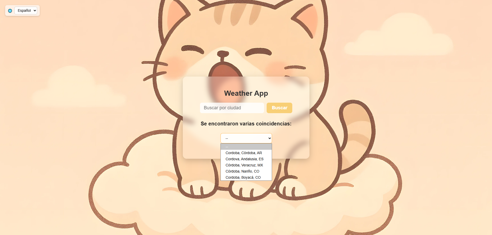
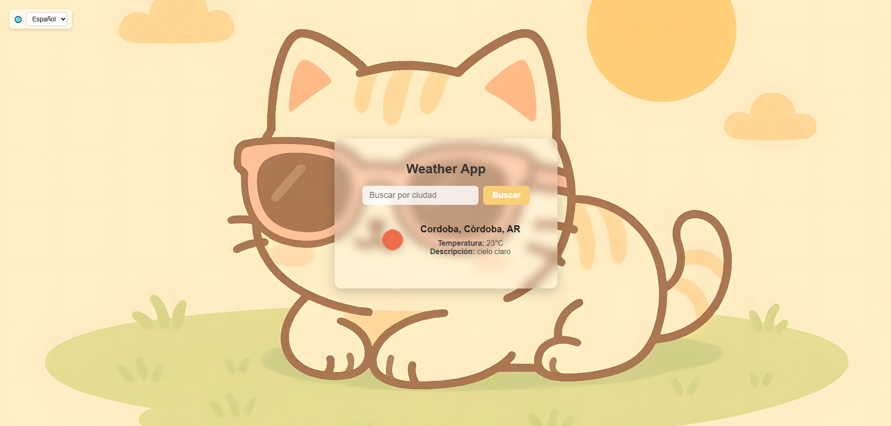
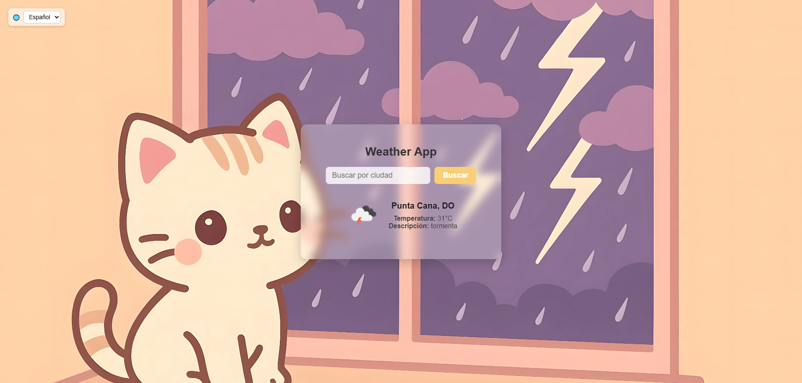

# 🌦️ Weather App

Aplicación web simple y moderna para consultar el clima actual de cualquier ciudad en el mundo, desarrollada con **HTML, CSS y JavaScript**, y consumiendo la API de [OpenWeather](https://openweathermap.org/).

## ✨ Características

- 🔍 **Búsqueda de ciudades**: ingresá el nombre de la ciudad y obtené el clima en tiempo real.
- 🌐 **Selector de idioma**: interfaz y descripciones en **español** o **inglés**.
- 📸 **Cambio de fondo dinámico**: imágenes que se actualizan según el clima (soleado, nublado, lluvia, nieve, tormenta).
- 🖼️ **Diseño moderno**: tarjeta con estilo **glassmorphism** y animaciones de transición suaves.
- 📱 **Responsive**: se adapta a dispositivos móviles y pantallas grandes.
- 💾 **LocalStorage**: recuerda el idioma elegido.

## 🛠️ Tecnologías usadas

- **HTML5**
- **CSS3** (flexbox, glassmorphism, animaciones)
- **JavaScript (ES6+)**
- **OpenWeather API** para datos meteorológicos

## Capturas de pantalla

